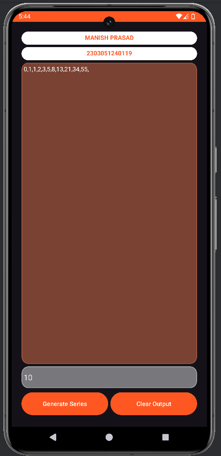

# Fibonacci Series App

Welcome to the Fibonacci Series App, a simple Android application developed in Android Studio using Java! This app enables users to quickly generate a Fibonacci sequence based on an integer input, making it a useful tool for learning about this famous mathematical series.

---

## Project Overview

This app was developed to showcase fundamental Android development skills, including:

- Building a user interface with XML.
- Managing user input and events.
- Implementing mathematical logic for generating Fibonacci sequences in Java.

---

## Features

- **Fibonacci Sequence Generation**: Takes an integer input from the user and generates the Fibonacci series up to that number of terms.
- **Clear Interface**: Simple and intuitive layout for easy input and quick results display.
- **Real-Time Calculation**: Instantly displays the Fibonacci series upon input.

---

## Repository Contents

This repository includes the following files:

1. **Fib_Interface.png**: A screenshot displaying the app’s interface and layout.
2. **Fibonacci Java.docx**: The Java source code file for handling user input and generating the Fibonacci series.
3. **Fib Working.mp4**: A screen recording demonstrating the app's functionality in action.
4. **Fibonacci xml.docx**: The XML layout file used to design the user interface in Android Studio.

---

## How to Run the App

1. Clone this repository to your local machine.
2. Open the project in **Android Studio**.
3. Import the Java and XML code provided in the respective `.docx` files.
4. Build and run the app on an Android device or emulator.

---

## Screenshots & Demo

Click on the image below to watch the video demonstration of the app:

---

## Future Improvements

As I continue to learn and grow as a developer, I plan to add more advanced features and enhancements in future updates!

---

## Feedback

Feel free to explore the code and share your feedback or suggestions for improvement!

---

Thank you for checking out my project!
